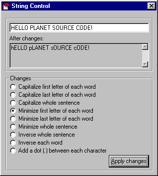



## String Control

### Description

This code can do many modifications to a string. (See screenshot for more details). I was tired of seeing programs that showed only one string modification so I programmed something that could modify a string in more than one way. (Code is explained).
 
### More Info
 

             |
---                |---
**Submitted On**   |2000-12-04 20:49:58
**By**             |[NightWolf](https://github.com/Planet-Source-Code/PSCIndex/blob/master/ByAuthor/nightwolf.md)
**Level**          |Intermediate
**User Rating**    |4.0 (20 globes from 5 users)
**Compatibility**  |VB 3\.0, VB 4\.0 \(16\-bit\), VB 4\.0 \(32\-bit\), VB 5\.0, VB 6\.0
**Category**       |[String Manipulation](https://github.com/Planet-Source-Code/PSCIndex/blob/master/ByCategory/string-manipulation__1-5.md)
**World**          |[Visual Basic](https://github.com/Planet-Source-Code/PSCIndex/blob/master/ByWorld/visual-basic.md)
**Archive File**   |[CODE\_UPLOAD123441242000\.zip](https://github.com/Planet-Source-Code/nightwolf-string-control__1-13334/archive/master.zip)

